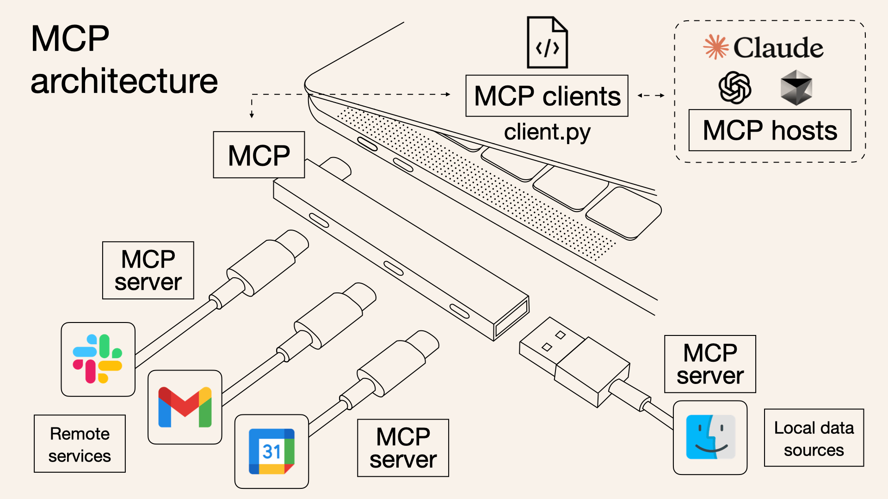
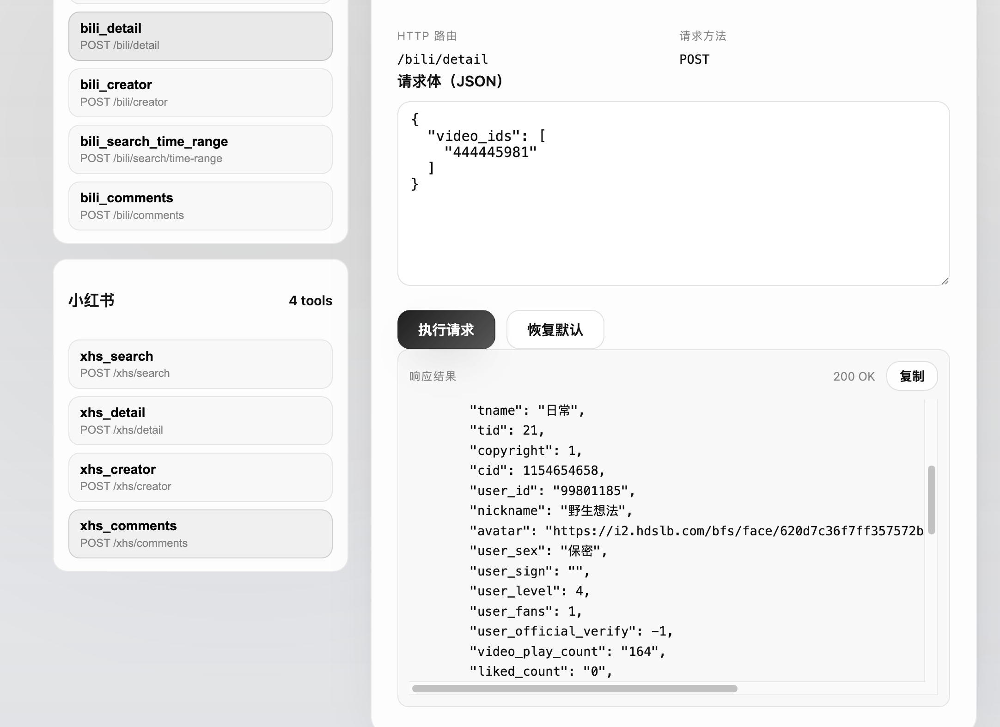
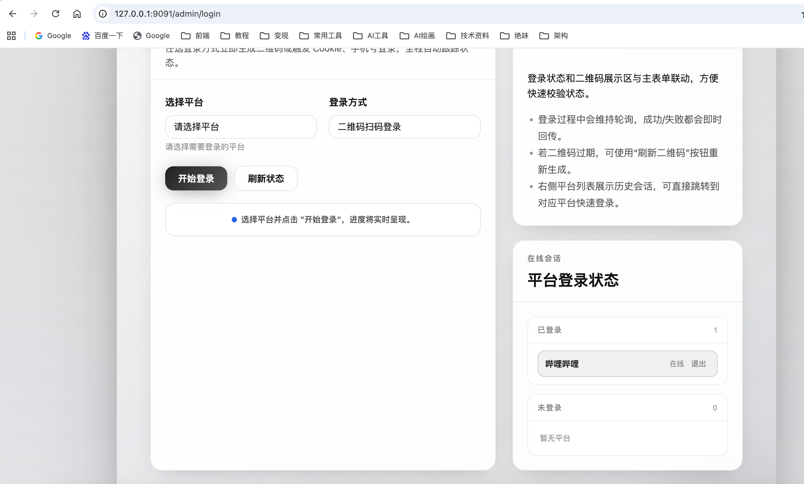
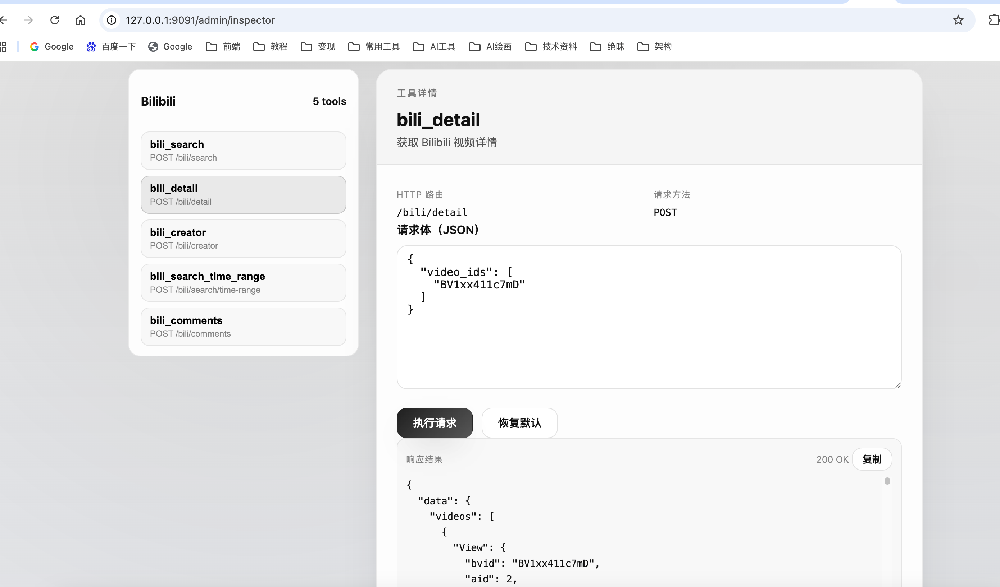

# MediaCrawler MCP 服务



让 AI 原生使用社媒数据的MCP服务。爬虫部分参考了[MediaCrawler](https://github.com/NanmiCoder/MediaCrawler)，将其 CLI 爬虫升级为 MCP 标准工具，让 Claude / ChatGPT 直连调用，一次配置，长期可用。


<p>
  
  
  
  
  
</p>

## 目录
- [项目简介](#项目简介)
- [核心特性](#核心特性)
- [快速开始](#快速开始)
- [管理界面与登录](#管理界面与登录)
- [在 AI 助手中使用](#在-ai-助手中使用)
- [工具总览](#工具总览)
- [架构与技术选择](#架构与技术选择)
- [Roadmap](#roadmap)
- [开发与贡献](#开发与贡献)
- [FAQ](#faq)
- [合规与合理使用](#合规与合理使用)

## 项目简介

MediaCrawler MCP Service 是面向个人的数据获取工具集，通过 MCP（Model Context Protocol）把社媒公开信息变成 AI 助手可直接调用的标准化工具。核心能力包括“登录外部化管理”“任务级配置隔离”“浏览器上下文复用”和“结构化数据输出”。


## 关键优势：

### 从脚本到标准：可复用的 MCP 工具

> media-crawler-mcp-service 打破了传统的临时脚本模式，转变为 可复用的标准化 MCP 工具。它支持多平台数据抓取，功能模块化设计让扩展和维护变得更加高效，不再需要重复编写脚本。

### 登录完全外部化：可视化界面 + 二维码/Cookie 双模式，状态持久

> 采用 外部化登录机制，提供 可视化界面 和 二维码/Cookie 双模式，让身份验证更加灵活。支持 登录状态持久化，避免频繁登录操作，提升了数据抓取的稳定性与便捷性。

### 真·工程化：分层解耦、Pydantic 模型、状态缓存与风控友好

> 采用 分层解耦架构 和 Pydantic 模型，保证了高效的数据验证和一致性。状态缓存 和 风控设计 让系统更加稳定，减少了负载并提高了抓取效率。

### 文本格式友好：适合 AI 分析，不返回冗余嵌套数据

> 与其他同类型MCP相比，media-crawler-mcp-service 返回的抓取数据 简洁、无冗余，特别适合 AI 分析。避免复杂的嵌套数据，让 AI 模型可以更轻松、更高效地处理数据。

| 特性                     | `media-crawler-mcp-service`        | **MediaCrawler**     | **Bowenwin MCP Server**  |
|------------------------|-----------------------------------|-------------------------|-----------------------------|
| **从脚本到标准**        | ✅ 可复用的 MCP 工具               | ❌ 仅支持一次性脚本，不可复用   | ✅ 支持部分模块化，但不完全标准化  |
| **登录方式**            | ✅ 可视化界面 + 二维码/Cookie 双模式 | ❌ 基础登录模式，缺乏灵活性      | ❌ 登录功能不完善，手动操作较多    |
| **工程化设计**          | ✅ 分层解耦、Pydantic 模型、状态缓存 | ❌ 架构不清晰，紧耦合          | ❌ 缺乏工程化设计，模块化不清晰    |
| **数据格式**            | ✅ 文本友好，适合 AI 分析           | ❌ 返回复杂的 JSON 数据，难以处理 | ❌ 数据结构混乱，不适合 AI 分析    |
| **社区支持**            | ✅ 持续迭代，社区支持               | ❌ 社区活跃度低，支持有限        | ❌ 无社区支持，项目已不再更新     |


## 项目开发 Todo List

### 已完成
- [x] 独立化登陆模块
- [x] B 站搜索/详情/创作者/评论
  - `bili_search`
  - `bili_detail`
  - `bili_creator`
  - `bili_comments`

- [x] 小红书搜索/详情/创作者/评论
  - `xhs_search`
  - `xhs_detail`
  - `xhs_creator`
  - `xhs_comments`

### 进行中
- [ ] 抖音
- [ ] 快手
- [ ] 知乎
- [ ] 贴吧
- [ ] 微博
- [ ] 其他外部api
- [ ] JWT 鉴权：简单集成并实现安全的身份验证机制
- [ ] MCP/Resource，MCP/prompt的编写
- [ ] 增加部分渠道的文章发布功能
- [ ] **最佳 n8n 实践编写（欢迎共创）**：根据真是业务需求编写用到此mcp的 n8n 工作流并进行实际编写与优化。

**非目标**：
- 不做复杂权限管理，MCP一般作为个人本地服务/企业内部服务，接入企业内部网关鉴权更合理，这里不做复杂封装。
- 不做多账号池/多租户/分布式集群等复杂特性
- 保持架构清晰，提供可扩展点，鼓励他人自行按需扩展


## 快速开始

环境要求：Python 3.13+ · Redis · Chrome/Chromium ·（可选）Node.js 16+

1) 克隆与安装依赖
```bash
git clone <your-repo-url>
cd media-crawler-mcp-service
poetry install
poetry run playwright install chromium
```

2) 配置环境
```bash
cp .env.example .env
# 按需修改端口/平台开关/Redis 等
```

3) 启动服务
```bash
redis-server                 # 如未启动
poetry run python main.py    # 默认端口 9090

# 管理界面: http://localhost:9090/admin
# 工具调试: http://localhost:9090/admin/inspector
```

## 管理界面与登录

### 1) 打开管理界面 `http://localhost:9090/admin`
   
### 2) 进入“登录管理”，选择平台（如 B 站）
   
### 3) 支持“二维码登录”或“Cookie 登录”，状态会持久化
   

## 在 AI 助手中使用

## 在 AI 助手中使用

### 多端点架构支持

从版本 2.0 开始，支持多 MCP 端点架构，每个平台提供独立的 MCP 连接：

```
主服务端点：    /mcp        - 服务级工具（health, list_tools等）  
小红书端点：    /mcp/xhs    - 小红书专用工具
B站端点：      /mcp/bili   - B站专用工具  
统一爬虫端点：  /mcp/crawl  - 跨平台统一工具
```

**连接方式：**
- **完整服务**: `http://localhost:9090/mcp` (包含所有平台工具)
- **小红书专用**: `http://localhost:9090/mcp/xhs` (仅小红书工具)
- **B站专用**: `http://localhost:9090/mcp/bili` (仅B站工具)
- **统一爬虫**: `http://localhost:9090/mcp/crawl` (跨平台工具)

**使用建议：**
- 如需特定平台功能，连接对应子端点获得更纯净的工具集
- 如需跨平台分析，使用统一爬虫端点或主端点
- 在管理界面的 MCP Inspector 中可切换不同端点进行调试

你可以直接在 Claude/ChatGPT 中配置对应的 MCP 链接：
```
示例对话：
“帮我搜索 Python 机器学习相关的 B 站视频，并分析受欢迎程度与创作者。”
→ 自动调用 `bili_search` 获取数据 → 结合指标分析 → 输出洞察
```

## 工具总览

管理页的 MCP Tools Inspector 支持多端点切换，可查看不同端点的工具并进行在线调试。

### 端点工具分布

**主服务端点** (`/mcp`)：
- `service_info` - 服务信息
- `service_health` - 健康检查  
- `list_tools` - 工具列表
- `tool_info` - 工具详情

**B站端点** (`/mcp/bili`)：

- `bili_search`（推荐，快速搜索）
```json
{
  "keywords": "Python 机器学习",
  "page_size": 3,
  "page_num": 1
}
```

- `bili_detail`（指定视频详情）
```json
{
  "video_ids": [
    "444445981"
  ]
}
```

- `bili_creator`（创作者分析）
```json
{ "creator_ids": ["99801185"], "creator_mode": true }
```



**小红书端点** (`/mcp/xhs`)：
- `xhs_search` - 小红书关键词搜索
- `xhs_detail` - 小红书笔记详情  
- `xhs_creator` - 小红书创作者作品
- `xhs_comments` - 小红书笔记评论

**统一爬虫端点** (`/mcp/crawl`)：
- `crawl_search` - 跨平台搜索
- `crawl_detail` - 跨平台详情
- `crawl_creator` - 跨平台创作者

### 工具使用示例

- `xhs_search`（小红书关键词搜索，返回本页摘要，不拉详情）
```json
{
  "keywords": "纯圆大嬛嬛",
  "page_num": 1,
  "page_size": 20
}
```

- `xhs_detail`（小红书笔记详情，不含评论；xsec_token 必传）
```json
{
  "note_id": "68f9b8b20000000004010353",
  "xsec_token": "从搜索结果或分享链接中获取（必传）",
  "xsec_source": "可选，未传时默认 pc_search"
}
```

- `xhs_creator`（小红书创作者作品，不含评论）
```json
{
  "creator_ids": ["user123", "user456"]
}
```

- `xhs_comments`（小红书笔记评论，单条获取）
```json
{
  "note_id": "68f9b8b20000000004010353",
  "xsec_token": "从搜索结果获取（必传）",
  "xsec_source": "可选，未传时默认 pc_search",
  "max_comments": 50
}
```

说明：
- **xsec_token 是必传参数**：小红书网页端对详情和评论访问存在严格的风控校验，`xhs_detail` 和 `xhs_comments` 都必须传入 `xsec_token`（可从 `xhs_search` 返回结果中获取，或从分享链接解析）。
- **原子化设计**：`xhs_comments` 仅支持单条笔记查询，不支持批量，符合 MCP 工具原子化原则。
- **数据完整性**：所有工具返回的数据已包含完整的用户信息（user_id、nickname、avatar）和交互数据（点赞、收藏、评论、分享数），支持中文数字格式解析（如"3万"自动转为 30000）。
- **评论获取已独立**：`xhs_detail` 仅返回笔记详情，需要评论时请单独调用 `xhs_comments` 工具。
- 当未传 `xsec_source` 时，服务会默认使用 `pc_search`；仍无法访问时请检查登录态、token 是否过期或笔记是否被限制浏览。

## 架构与技术选择

```
🤖 AI 助手 (Claude / ChatGPT)
           │  MCP Protocol
           ▼
🎯 MediaCrawler MCP Service
  ├─ 管理层: 登录/状态/配置
  ├─ 服务层: 各平台编排 (Bili…)
  └─ 工具层: bili_search/detail/creator/comments
           │
           ▼
🌐 Playwright Browser（上下文复用 / 风控友好）
  ├─ BrowserManager 统一管理
  ├─ 平台级实例隔离（每个平台独立浏览器）
  ├─ Login 和 Crawler 共享同一实例
  └─ 引用计数 + 互斥锁保护
           │
           ▼
💾 Redis 状态缓存 · 本地/结构化存储
```

### 浏览器实例管理（亮点）

**问题背景：** 多平台环境下，浏览器实例管理不当会导致：
- 不同平台共享浏览器上下文，Cookie 和登录状态互相干扰
- 频繁创建/销毁浏览器实例，性能低下
- 登录会话与爬虫任务竞争资源，导致状态混乱

**解决方案：BrowserManager 统一管理**
- **平台级隔离**：每个平台（Bilibili、小红书等）维护独立的浏览器实例
- **上下文复用**：同一平台的 Login 和 Crawler 自动共享浏览器实例，避免重复创建
- **引用计数**：通过 `acquire_context()` 和 `release_context()` 精确管理实例生命周期
- **互斥锁保护**：防止并发创建多个实例，确保线程安全
- **登录防抖**：平台级登录锁，防止用户多次点击触发重复登录请求

**效果：**
- 浏览器启动时间从 3-5s 降至 0.1s（上下文复用）
- 登录状态稳定，不再出现平台间干扰
- 防止并发登录导致的资源竞争

对比传统 CLI 脚本：
- 调用方式：脚本 → MCP 工具（AI 原生支持）
- 登录管理：脚本内逻辑 → 外部化页面 + 持久化
- 性能：每次冷启动 → 浏览器常驻复用（3-5s → 0.1s）
- 设计：全局变量 → 任务级配置隔离 + 平台级浏览器隔离
- 输出：原始结果 → Pydantic 结构化

## Roadmap
- 小红书 / 抖音 / 快手 / 知乎 / 微博 / 贴吧 适配
- 工具调试器与可视化增强（过滤、导出、趋势）
- 更细粒度的速率与风控策略
- 更多存储目标（PGSQL 持久化）

## 开发与贡献

参考路径：
- 启动入口：`main.py:1`
- 应用工厂：`app/api_service.py:1`
- 管理界面路由：`app/api/endpoints/admin/admin_page_endpoint.py:1`
- 工具清单接口：`app/api/endpoints/admin/mcp_inspector_endpoint.py:1`

新增平台的典型步骤：
1) 添加登录适配器：`app/core/login/{platform}/...`
2) 实现平台爬虫与编排：`app/core/crawler/platforms/{platform}/...`
3) 包装为 MCP 工具：`app/core/mcp_tools/{platform}.py`
4) 注册路由：`app/api/endpoints/mcp/{platform}.py`

更多部署与运维选项：`deploy/README.md:1`

贡献流程：
1) Fork 并创建特性分支
2) 阅读项目规范：`Agent.md:1`
3) 本地开发与自测
4) 提 PR 并说明变更点

## FAQ

启动失败？
```bash
poetry install
poetry run playwright install chromium
redis-cli ping   # 期望 PONG
APP__DEBUG=true poetry run python main.py
```

二维码不显示？
```bash
BROWSER__HEADLESS=false poetry run python main.py
poetry run playwright install-deps chromium
```

登录状态易失？
- 确认 Redis 稳定、网络正常；避免高频触发风控

搜索为空或慢？
- 优先使用 `bili_search`，降低分页尺寸，放大请求间隔

## 合规与合理使用

本项目定位为个人效率工具：
- 遵守各平台使用条款与 robots.txt
- 合理控制频率，不对平台造成压力
- 尊重内容创作者，不用于商业化爬取
- 建议单次请求量小、请求间隔 ≥ 2s

如果这个项目对你的学习有帮助，欢迎 ⭐ Star 支持！
