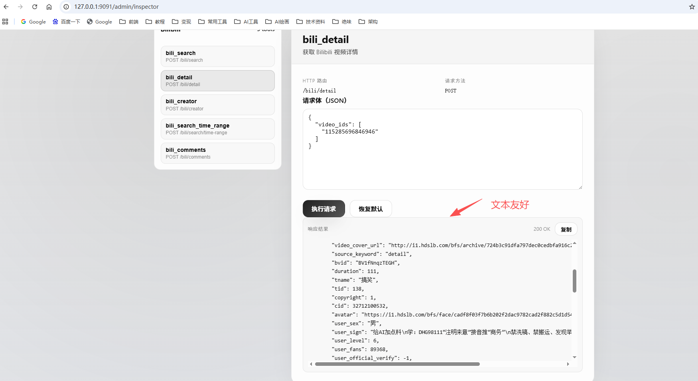

# MediaCrawler MCP 服务

让 AI 原生使用社媒数据的MCP服务。将传统 CLI 爬虫升级为 MCP 标准工具，让 Claude / ChatGPT 直连调用，一次配置，长期可用。


<p>
  
  
  
  
  
</p>

## 目录
- 项目简介
- 核心特性
- 快速开始
- 管理界面与登录
- 在 AI 助手中使用
- 工具总览
- 架构与技术选择
- Roadmap
- 开发与贡献
- FAQ
- 合规与合理使用

## 项目简介

MediaCrawler MCP Service 是面向“学习与研究”的数据获取工具集，通过 MCP（Model Context Protocol）把社媒公开信息变成 AI 助手可直接调用的标准化工具。核心能力包括“登录外部化管理”“任务级配置隔离”“浏览器上下文复用”和“结构化数据输出”。

为什么与众不同？
- 从脚本到标准：从一次性脚本变成可复用的 MCP 工具
- 登录完全外部化：可视化界面 + 二维码/Cookie 双模式，状态持久
- 真·工程化：分层解耦、Pydantic 模型、状态缓存与风控友好
- 文本格式友好: 需要AI分析，所以要返回文本友好的格式，不是大量无用的嵌套数据

## 核心特性
- 一次配置，AI 原生调用（Claude/ChatGPT）
- 登录外部化：跨重启保持，支持多平台
- 任务级配置隔离，消除全局变量竞争
- Playwright 浏览器上下文复用，秒级响应
- Pydantic 结构化输出，易于分析与存档
- 内建状态缓存与风控友好策略

当前已实现与进行中：
- 已完成：B 站搜索/详情/创作者/评论（`bili_search`/`bili_detail`/`bili_creator`/`bili_comments`）
- 进行中：小红书 / 抖音 / 快手 / 知乎 / 贴吧 / 微博等

## 快速开始

环境要求：Python 3.8+ · Redis · Chrome/Chromium ·（可选）Node.js 16+

1) 克隆与安装依赖
```bash
git clone <your-repo-url>
cd media-crawler-mcp-service
poetry install
poetry run playwright install chromium
```

2) 配置环境
```bash
cp .env.example .env
# 按需修改端口/平台开关/Redis 等
```

3) 启动服务
```bash
redis-server                 # 如未启动
poetry run python main.py    # 默认端口 9090

# 管理界面: http://localhost:9090/admin
# 工具调试: http://localhost:9090/admin/inspector
```

## 管理界面与登录

1) 打开管理界面 `http://localhost:9090/admin`
2) 进入“登录管理”，选择平台（如 B 站）
3) 支持“二维码登录”或“Cookie 登录”，状态会持久化


## 在 AI 助手中使用

你可以直接在 Claude/ChatGPT 中让其调用 MCP 工具：
```
示例对话：
“帮我搜索 Python 机器学习相关的 B 站视频，并分析受欢迎程度与创作者。”
→ 自动调用 `bili_search` 获取数据 → 结合指标分析 → 输出洞察
```

## 工具总览

管理页的 MCP Tools Inspector 可查看所有已注册工具，并进行在线调试。

- `bili_search`（推荐，快速搜索）
```json
{
  "keywords": "Python 机器学习",
  "page_size": 3,
  "page_num": 1
}
```

- `bili_detail`（指定视频详情）
```json
{ "video_ids": ["115285696846946"] }
```

- `bili_creator`（创作者分析）
```json
{ "creator_ids": ["99801185"], "creator_mode": true }
```


## 架构与技术选择

```
🤖 AI 助手 (Claude / ChatGPT)
           │  MCP Protocol
           ▼
🎯 MediaCrawler MCP Service
  ├─ 管理层: 登录/状态/配置
  ├─ 服务层: 各平台编排 (Bili…)
  └─ 工具层: bili_search/detail/creator/comments
           │
           ▼
🌐 Playwright Browser（上下文复用 / 风控友好）
           │
           ▼
💾 Redis 状态缓存 · 本地/结构化存储
```

对比传统 CLI 脚本：
- 调用方式：脚本 → MCP 工具（AI 原生支持）
- 登录管理：脚本内逻辑 → 外部化页面 + 持久化
- 性能：每次冷启动 → 浏览器常驻复用
- 设计：全局变量 → 任务级配置隔离
- 输出：原始结果 → Pydantic 结构化

## Roadmap
- 小红书 / 抖音 / 快手 / 知乎 / 微博 / 贴吧 适配
- 工具调试器与可视化增强（过滤、导出、趋势）
- 更细粒度的速率与风控策略
- 更多存储目标（SQLite/DB 持久化）

## 开发与贡献

参考路径：
- 启动入口：`main.py:1`
- 应用工厂：`app/api_service.py:1`
- 管理界面路由：`app/api/endpoints/admin/admin_page_endpoint.py:1`
- 工具清单接口：`app/api/endpoints/admin/mcp_inspector_endpoint.py:1`

新增平台的典型步骤：
1) 添加登录适配器：`app/core/login/{platform}/...`
2) 实现平台爬虫与编排：`app/core/crawler/platforms/{platform}/...`
3) 包装为 MCP 工具：`app/core/mcp_tools/{platform}.py`
4) 注册路由：`app/api/endpoints/mcp/{platform}.py`

更多部署与运维选项：`deploy/README.md:1`

贡献流程：
1) Fork 并创建特性分支
2) 阅读项目规范：`Agent.md:1`
3) 本地开发与自测
4) 提 PR 并说明变更点

## FAQ

启动失败？
```bash
poetry install
poetry run playwright install chromium
redis-cli ping   # 期望 PONG
APP__DEBUG=true poetry run python main.py
```

二维码不显示？
```bash
BROWSER__HEADLESS=false poetry run python main.py
poetry run playwright install-deps chromium
```

登录状态易失？
- 确认 Redis 稳定、网络正常；避免高频触发风控

搜索为空或慢？
- 优先使用 `bili_search`，降低分页尺寸，放大请求间隔

## 合规与合理使用

本项目定位为“学习与研究”的效率工具：
- 遵守各平台使用条款与 robots.txt
- 合理控制频率，不对平台造成压力
- 尊重内容创作者，不用于商业化爬取
- 建议单次请求量小、请求间隔 ≥ 2s

如果这个项目对你的学习有帮助，欢迎 ⭐ Star 支持！

