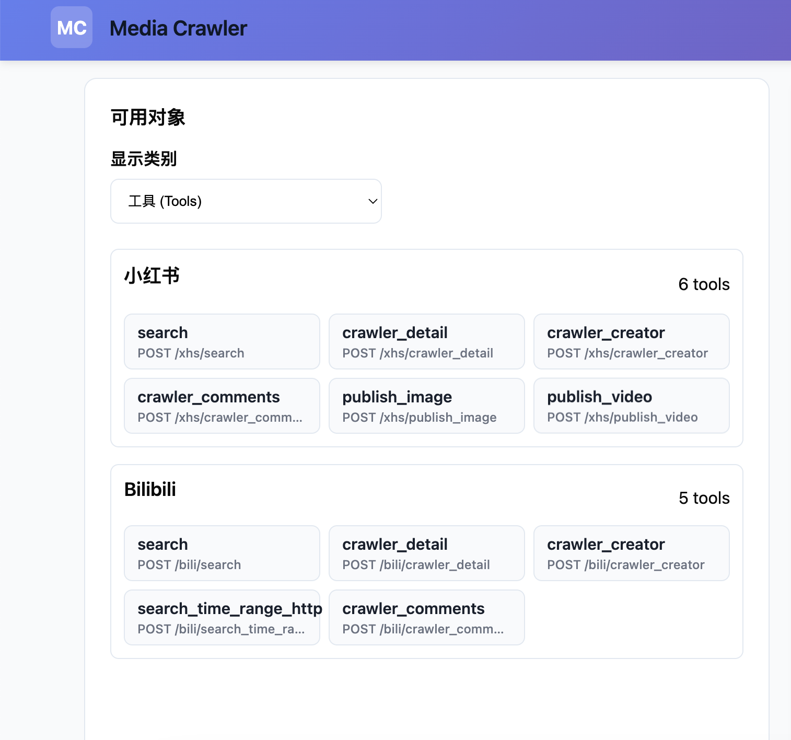

# MediaCrawler MCP 服务

让 AI 原生使用社媒数据的MCP服务。爬虫部分参考了[MediaCrawler](https://github.com/NanmiCoder/MediaCrawler)，将其 CLI 爬虫升级为 MCP 标准工具，让 Claude / ChatGPT 直连调用，一次配置，长期可用。


<p>
  
  
  
  
  
</p>

## 目录
- [项目简介](#项目简介)
- [核心特性](#核心特性)
- [快速开始](#快速开始)
- [管理界面与登录](#管理界面与登录)
- [在 AI 助手中使用](#在-ai-助手中使用)
- [工具总览](#工具总览)
- [架构与技术选择](#架构与技术选择)
- [Roadmap](#roadmap)
- [开发与贡献](#开发与贡献)
- [FAQ](#faq)
- [合规与合理使用](#合规与合理使用)

## 项目简介

MediaCrawler MCP Service 是面向个人的数据获取工具集，通过 MCP（Model Context Protocol）把社媒公开信息变成 AI 助手可直接调用的标准化工具。核心能力包括“登录外部化管理”“任务级配置隔离”“浏览器上下文复用”和“结构化数据输出”。

本项目现已聚焦“高质量内容的爬取与自动化”，稳定与质量优先：

- 优先支持高质量生态：Bilibili、小红书，其次抖音、微博、知乎、贴吧等。
- 强调可持续的抗风控策略与最小化请求规模的精确抓取。
- 输出面向 AI 分析的扁平结构，避免冗余嵌套与噪声字段。

聚焦方向（高质量内容）：

- 哔哩哔哩：视频内容与互动数据，适合视频分析与社交行为分析。
- 小红书：电商导购、产品推荐与品牌分析。
- 抖音：短视频与用户行为分析，适合营销效果评估。
- 微博：舆情分析与热点追踪。
- 知乎：知识管理与市场调研，专业领域分析价值高。


## 关键优势：

- UI 升级为 FastMCP UI，管理页（/dashboard, /login, /config, /inspector）全部迁移并稳定运行。
- 重构爬虫配置装配：去冗余封装，收敛为函数式构建与更清晰的分层。
- 小红书改为 DOM 定位策略以降低风控敏感度，抓取更稳定（逐步完善中）。
- Bilibili 登录与抓取逻辑优化，测试通过，运行稳定；移除部分 service 层 option 封装。
- 路由改为直接使用 FastMCP 路由与蓝图，统一注册与调试体验。

同时，数据持久化目录与展示统一为平台代号：

- 目录统一：`bili`、`xhs`，不再使用历史目录名（如 `bilibili`）。
- B 站媒体落盘路径：`data/bili/videos`。
- “数据持久化概览”统计同时计入 `json/csv` 与 `videos` 子目录体积。


### 从脚本到标准：可复用的 MCP 工具

> media-crawler-mcp-service 打破了传统的临时脚本模式，转变为 可复用的标准化 MCP 工具。它支持多平台数据抓取，功能模块化设计让扩展和维护变得更加高效，不再需要重复编写脚本。

### 登录完全外部化：可视化界面 + 二维码/Cookie 双模式，状态持久

> 采用 外部化登录机制，提供 可视化界面 和 二维码/Cookie 双模式，让身份验证更加灵活。支持 登录状态持久化，避免频繁登录操作，提升了数据抓取的稳定性与便捷性。

### 真·工程化：分层解耦、Pydantic 模型、状态缓存与风控友好

> 采用 分层解耦架构 和 Pydantic 模型，保证了高效的数据验证和一致性。状态缓存 和 风控设计 让系统更加稳定，减少了负载并提高了抓取效率。

### 文本格式友好：适合 AI 分析，不返回冗余嵌套数据


> 与其他同类型MCP相比，media-crawler-mcp-service 返回的抓取数据 简洁、无冗余，特别适合 AI 分析。避免复杂的嵌套数据，让 AI 模型可以更轻松、更高效地处理数据。

| 特性                     | `media-crawler-mcp-service`        | **MediaCrawler**     | **Bowenwin MCP Server**  |
|------------------------|-----------------------------------|-------------------------|-----------------------------|
| **从脚本到标准**        | ✅ 可复用的 MCP 工具               | ❌ 仅支持一次性脚本，不可复用   | ✅ 支持部分模块化，但不完全标准化  |
| **登录方式**            | ✅ 可视化界面 + 二维码/Cookie 双模式 | ❌ 基础登录模式，缺乏灵活性      | ❌ 登录功能不完善，手动操作较多    |
| **工程化设计**          | ✅ 分层解耦、Pydantic 模型、状态缓存 | ❌ 架构不清晰，紧耦合          | ❌ 缺乏工程化设计，模块化不清晰    |
| **数据格式**            | ✅ 文本友好，适合 AI 分析           | ❌ 返回复杂的 JSON 数据，难以处理 | ❌ 数据结构混乱，不适合 AI 分析    |
| **社区支持**            | ✅ 持续迭代，社区支持               | ❌ 社区活跃度低，支持有限        | ❌ 无社区支持，项目已不再更新     |


## 项目开发 Todo List

### 已完成
- [x] 独立化登陆模块
- [x] B 站搜索/详情/创作者/评论
  - `bili_search`
  - `bili_detail`
  - `bili_creator`
  - `bili_comments`

- [ ] 小红书搜索/详情/创作者/评论，**最近风控，正在修复**
  - `xhs_search`
  - `xhs_detail`
  - `xhs_creator`
  - `xhs_comments`

### 进行中
- [ ] 抖音
- [ ] 知乎
- [ ] 微博
- [ ] 其他外部api
- [ ] JWT 鉴权：简单集成并实现安全的身份验证机制
- [ ] MCP/Resource，MCP/prompt的编写
- [ ] 增加部分渠道的文章发布功能
- [ ] **最佳 n8n 实践编写（欢迎共创）**：根据真是业务需求编写用到此mcp的 n8n 工作流并进行实际编写与优化。

**非目标**：
- 不做复杂权限管理，MCP一般作为个人本地服务/企业内部服务，接入企业内部网关鉴权更合理，这里不做复杂封装。
- 不做多账号池/多租户/分布式集群等复杂特性
- 保持架构清晰，提供可扩展点，鼓励他人自行按需扩展


## 快速开始

环境要求：Python 3.13+ · Redis · Chrome/Chromium ·（可选）Node.js 16+

1) 克隆与安装依赖
```bash
git clone <your-repo-url>
cd media-crawler-mcp-service
poetry install
poetry run playwright install chromium
```

2) 配置环境
```bash
cp .env.example .env
# 按需修改端口/平台开关/Redis 等
```

3) 启动服务
```bash
redis-server                 # 如未启动
poetry run python main.py    # 默认端口 9090

# 管理界面: http://localhost:9090/admin
# 工具调试: http://localhost:9090/admin/inspector
```

## 管理界面与登录

### 1) 打开管理界面 `http://localhost:9090/admin`
   
### 2) 进入“登录管理”，选择平台（如 B 站）
   
### 3) 支持“二维码登录”或“Cookie 登录”，状态会持久化
   


## 在 AI 助手中使用

### MCP 连接

- MCP SSE 端点：`http://localhost:9090/mcp`
- 管理页面提供在线调试：`http://localhost:9090/inspector`
- 本地/内网默认无鉴权；公网部署请增加网关鉴权。

### 工具命名与平台代号

- 工具名统一为 `{platform}_{tool}`，平台代号：`bili`（哔哩哔哩）、`xhs`（小红书）。
- 已注册示例：
  - B 站：`bili_search`、`bili_crawler_detail`、`bili_crawler_creator`、`bili_search_time_range_http`、`bili_crawler_comments`
  - 小红书：`xhs_search`、`xhs_crawler_detail`、`xhs_crawler_creator`、`xhs_crawler_comments`

### 在 ChatGPT / Claude 中配置

- 将 MCP 服务器地址设置为上面的 SSE 端点。
- 选择相应工具名与参数调用；不确定参数时，先在 `/inspector` 验证。

### 常用调用示例

- B 站搜索（bili_search）
```json
{
  "keywords": "Python 机器学习",
  "page_size": 3,
  "page_num": 1
}
```

- B 站视频详情（bili_crawler_detail）
```json
{
  "video_ids": ["444445981"]
}
```

- 小红书搜索（xhs_search）
```json
{
  "keywords": "咖啡",
  "page_num": 1,
  "page_size": 20
}
```

- 小红书详情（xhs_crawler_detail，xsec_token 必传）
```json
{
  "note_id": "68f9b8b20000000004010353",
  "xsec_token": "从搜索结果或分享链接解析",
  "xsec_source": "pc_search"
}
```

## 工具总览

管理页的 MCP Tools Inspector 会按平台分组展示已注册工具，并可在线调用调试。

### 工具分布（按平台分组）

- 服务工具（service）
  - `service_info` - 服务信息
  - `service_health` - 健康检查
  - `list_tools` - 工具列表
  - `tool_info` - 工具详情

- B 站（bili）
  - `bili_search` - 关键词搜索
  - `bili_crawler_detail` - 视频详情
  - `bili_crawler_creator` - 创作者内容/信息
  - `bili_search_time_range_http` - 时间范围搜索
  - `bili_crawler_comments` - 视频评论

- 小红书（xhs）
  - `xhs_search` - 关键词搜索
  - `xhs_crawler_detail` - 笔记详情（需 xsec_token）
  - `xhs_crawler_creator` - 创作者作品
  - `xhs_crawler_comments` - 笔记评论




## 架构与技术选择

```
🤖 AI 助手 (Claude / ChatGPT)
           │  MCP Protocol
           ▼
🎯 MediaCrawler MCP Service
  ├─ 管理层: 登录/状态/配置
  ├─ 服务层: 各平台编排 (Bili…)
  └─ 工具层: bili_search/detail/creator/comments
           │
           ▼
🌐 Playwright Browser（上下文复用 / 风控友好）
  ├─ BrowserManager 统一管理
  ├─ 平台级实例隔离（每个平台独立浏览器）
  ├─ Login 和 Crawler 共享同一实例
  └─ 引用计数 + 互斥锁保护
           │
           ▼
💾 Redis 状态缓存 · 本地/结构化存储
```

## 开发与贡献流程

1) Fork 并创建特性分支
2) 阅读项目规范：`Agent.md:1`
3) 本地开发与自测
4) 提 PR 并说明变更点

## FAQ

启动失败？
```bash
poetry install
poetry run playwright install chromium
redis-cli ping   # 期望 PONG
APP__DEBUG=true poetry run python main.py
```

二维码不显示？
```bash
BROWSER__HEADLESS=false poetry run python main.py
poetry run playwright install-deps chromium
```

登录状态易失？
- 确认 Redis 稳定、网络正常；避免高频触发风控

搜索为空或慢？
- 优先使用 `bili_search`，降低分页尺寸，放大请求间隔

## 合规与合理使用

本项目定位为个人效率工具：
- 遵守各平台使用条款与 robots.txt
- 合理控制频率，不对平台造成压力
- 尊重内容创作者，不用于商业化爬取
- 建议单次请求量小、请求间隔 ≥ 2s

如果这个项目对你的学习有帮助，欢迎 ⭐ Star 支持！
